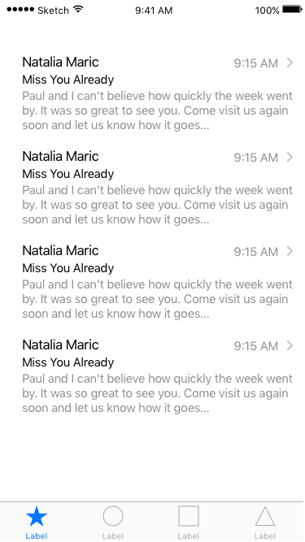
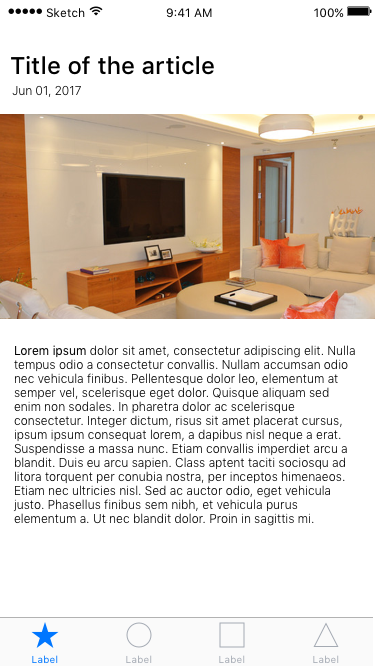

# Mobile exam app

## Objective

- The objective of this exam is to showcase the applicant's way of coding.

## App requirements

- The application must have a splash screen.
- The application must display's any list of objects came from any open rest api such as news, weather or blogs, etc.
- When the item was clicked, it must show the detailed view of the item.

## Instructions

- Fork the repository.
- After you finished your work, create a new branch and summit a pull request. Add ceosilvajr and rogermolas as a reviewer.
- Applicant is expected to submit his/her work 1 day after his/her interview.

## Sample Application

### Splash Screen

### List view 

### Detailed view 

